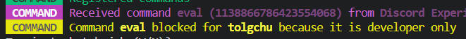

# `discord.js` Bot Template

This is a template for a Discord bot. It is written in JavaScript and uses the `discord.js` library. It is designed to be easy to use and easy to modify.

## Features

| Feature |
| --- |
| ✅ Very easy and simple |
| ✅ Supports most modern features such as slash commands, message components, modals... |
| ✅ Localization |
| ✅ Command Handler |
| ✅ Built-in commands |
| ✅ Error handler |
| ✅ Custom logger |
| ✅ Custom embeds |

## Setup

1. Clone this repository.
2. Run `npm install` to install dependencies.
3. Rename the `.env.example` file to `.env` and fill in the values.
4. Fill in the values in `config.json`.
5. Run `npm start` to start the bot.

## Commands

### Setting Up Commands

1. Create a new file in the `src/commands` directory.
2. Copy the following code into the file:

```js
const { SlashCommandBuilder, ChatInputCommandInteraction } = require("discord.js");

module.exports = {
    category: 'General', // The category the command belongs to. "Owner" and "Developer" are special categories. You can use anything as a category.
    data: new SlashCommandBuilder() // The command data
        .setName('command') // The name of the command
        .setDescription('Command description'), // The description of the command
    /**
     * @param {ChatInputCommandInteraction} interaction 
     */
    async execute(interaction) {
        interaction.reply('Hello, world!');
    }
};
```

3. Fill in the values in the code.

### Built-in Commands

- `ping`: Replies with the bot's ping.
- `help`: Replies with the help menu.
- `eval`: Evaluates JavaScript code.

## Embeds

We use a custom embed class to make it easier to create embeds. It is similar to `discord.js`'s `EmbedBuilder` but with default values. You can find the class in `src/modules/embed.js`.

### Creating an Embed

```js
const EmbedMaker = require('../modules/embed.js');

const embed = new EmbedMaker(client) // You can use interaction.client in command files
    .setTitle('Title')
    .setDescription('Description')
```

## Localization

### Adding a localization

1. Find your language file in `src/i18n` and open it. If it doesn't exist, create it.
2. Copy the following code into the file:

```js
module.exports = {
    MY_LOCALIZED_TEXT: 'My localized text',
    // ...
};
```

3. Fill in the values in the code.
4. Add your language to the `locales` object in `src/modules/localization.js`.

### Using a localization

```js
const { localize } = require('../modules/localization.js');

console.log(localize('en-US', 'MY_LOCALIZED_TEXT')); // Replace 'en-US' with the language code of your language file.
```

## Logger

We use a custom logger class to make it easier to log messages. You can find the class in `src/modules/logger.js`.

### Logging a message

**Method Usage:** `logger(type, title, ...messages)`

```js
const logger = require('../modules/logger.js');

logger('warning', 'COMMAND', 'Command', 'eval', 'blocked for', 'tolgchu', 'because it is developer only');
```

According to the above code, the logger will highlight "eval" and "tolgchu" parts.

